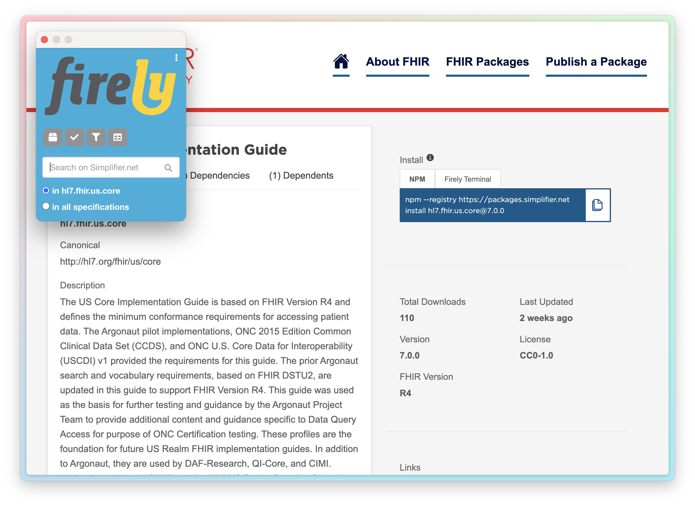

# Firely browser extension for FHIR

* Find the Chrome extension in the [Chrome Web Store](https://chromewebstore.google.com/detail/firely-fhir-extension/oofbicpdhcjcnbohhbcpgfmogeolgaah).
   * Should work on all Chromium based browsers, including Google Chrome, Microsoft Edge and Arc.
 * Find the Firefox extension in the [Firefox Browser Add-Ons store](https://addons.mozilla.org/en-US/firefox/addon/firely-fhir-extension/).

## Functionality

*Switching between different guide versions in an IG Publisher guide*

*Switching between different guide versions in a Simplifier guide*

*Package tools and search from a Simplifier package page*

*Package tools and search from a Registry package page*

### Search Capabilities
* Global search across all FHIR content via Simplifier.net
* Advanced filtering options:
  * Filter within current guide
  * Filter within current package
  * Filter by current FHIR version

### Version Management

#### IG Publisher Implementation Guide Navigation
For IG Publisher Implementation Guides and core FHIR specification:
* Displays current guide version
* Enables cross-version navigation to equivalent pages

#### Simplifier Implementation Guide Navigation
For Simplifier-based guides:
* Shows current version
* Provides navigation to:
  * All available versions
  * Latest version

### Package Tools
When a package name and version are detected, the following tools become available:

| Tool | Description |
|:---|:---|
| Package View | Access package directly on Simplifier |
| Validation | Validate content against the package |
| FHIRPath Query | Execute FHIRPath queries within the package |
| FQL Query | Execute FHIR Query Language (FQL) queries within the package |

### Recognized pages
Currently the following pages are recognized by the extension:
* Core FHIR specification and GitHub
* All guides and package pages on Simplifier.net
* All package pages on registry.fhir.org
* All guides published on HL7.org
  * Their current (build) URL, GitHub repo and canonical URL come from [this list](https://hl7.org/fhir/package-registry.json)
  * The versions come from package-list.json, eg [this one for US Core](https://hl7.org/fhir/us/core/package-list.json)
* All guides with a build guide on [build.fhir.org](https://build.fhir.org/ig)
  * Their current (build) URL, GitHub repo and canonical URL come from [this list](https://build.fhir.org/ig/qas.json)
  * The versions come from package-list.json, eg [this one for CH Core](https://fhir.ch/ig/ch-core/package-list.json). Note that the extension can only load this list when you're currently on the same domain.

## Development

Build:
1. `npm install`
2. `npm run build`

Chrome:
1. Go to [chrome://extensions](chrome://extensions) and turn on `Developer Mode` on top-right.
2. Click `Load unpacked` and select the `dist` folder where the browser plugin is located.

Firefox:
1. Install Firefox Developer Edition
2. In [about:debugging#/runtime/this-firefox](about:debugging#/runtime/this-firefox) load a `Temporary Add-On` and select the built Release.zip.

## Testing

1. `npm install --save-dev mocha chai`
2. `npm test`

## Publishing

Chrome:
* Release are published from the [Chrome Web Store Developer Dashboard](https://chrome.google.com/webstore/devconsole/) under the `Firely` publisher.
* Members from the [Firely Publishing Google Group](https://groups.google.com/g/firely-publishing) are able to publish, after setting up a Chrome Webstore Developer account.

Firefox:
* Release a new version from the [Developer Hub](https://addons.mozilla.org/en-US/developers/).
